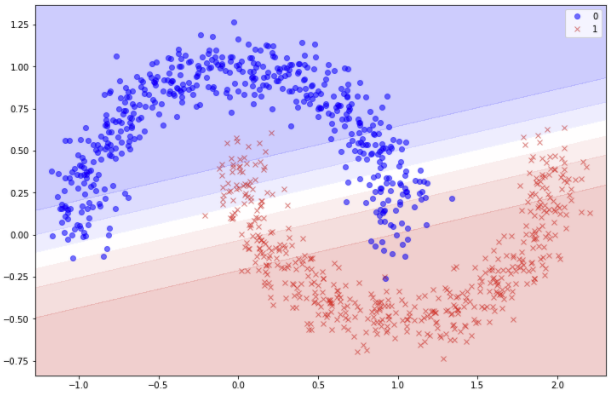
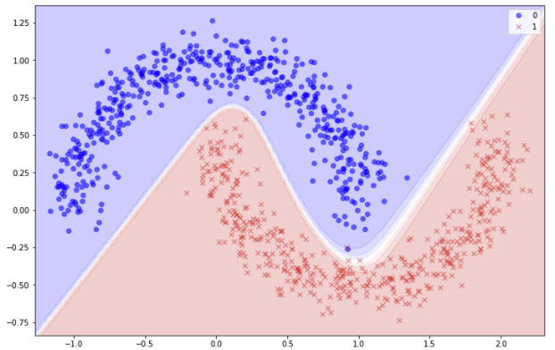
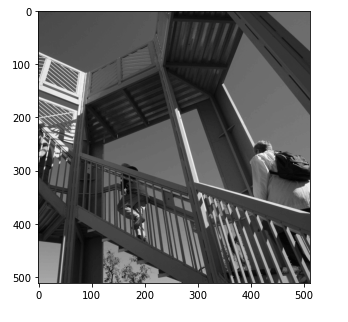
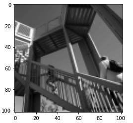
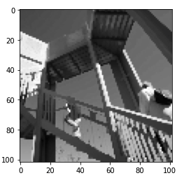

| Converge before | Converge after 
| - | - 
 | 
    
    
#MIN-MAX


| C- | C-avarage | C-max
| - | - | -
 | |  


#### Create the course environment

```
conda env create
```

wait for the environment to create.

#### Activate the environment (Mac/Linux)
```
conda activate ztdl
```

#### Activate the environment (Windows)
```
conda activate ztdl
```

Check that your prompt changed to

```
(ztdl) $
```

#### Launch Jupyter Notebook

```
jupyter notebook
```

#### Open your browser to

```
http://localhost:8888
```


```
conda deactivate
```

- deactivate the environment (Windows 10):

```
deactivate ztdl
```

- delete the environment:

```
conda remove -y -n ztdl --all
```

- restart from environment creation and make sure that each steps completes till the end.


